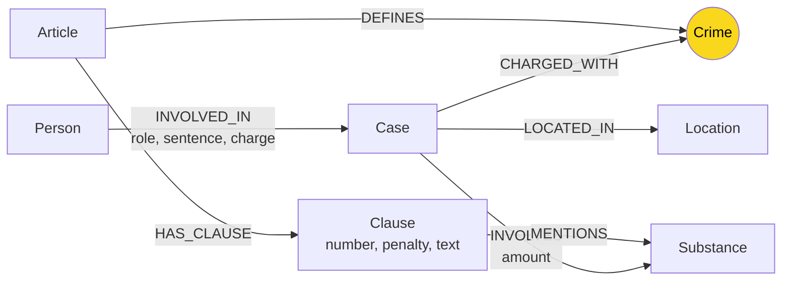

# Thiết kế Ontology

> ⚠️ Đọc `LAB_GUIDE.md` Bước 2 trước khi điền. Ghi tên sinh viên vào phần tác giả.
> File này bắt buộc phải nộp, kể cả khi dùng ontology gợi ý.

- **Tác giả:** Chu Minh Quân
- **Mã sinh viên:** 2A202602709

## 1. Sơ đồ Ontology

## 2. Chi tiết Entity (Node)

*Ví dụ: Person, Case, Article... Khóa là thuộc tính dùng để định danh duy nhất (trong MERGE).*

| Label | Thuộc tính quan trọng | Khóa (`CONSTRAINT ... UNIQUE`) | Lấy từ KB nào? |
| --- | --- | --- | --- |
| `Article` | `title`, `law`, `doc_id` | `id` ("Điều 251 BLHS") | Luật |
| `Clause` | `number`, `penalty`, `text`, `doc_id` | `id` ("Điều 251 BLHS khoản 1") | Luật |
| `Crime` | `name` | `name` (tên chuẩn hóa) | Cả hai |
| `Case` | `summary`, `date`, `doc_id` | `name` | Tin tức |
| `Substance` | `name` | `name` | Cả hai |
| `Person` | `aliases` | `name` | Tin tức |
| `Location` | `name` | `name` | Tin tức |

## 3. Chi tiết Relationship (Cạnh)

| Cạnh | Hướng | Thuộc tính trên cạnh | Ý nghĩa |
| --- | --- | --- | --- |
| `DEFINES` | `Article` → `Crime` | (Không có) | Luật định nghĩa tội danh |
| `HAS_CLAUSE`| `Article` → `Clause` | (Không có) | Điều luật gồm các khoản |
| `MENTIONS` | `Clause` → `Substance`| (Không có) | Khoản luật đề cập tới chất ma túy |
| `CHARGED_WITH`| `Case` → `Crime` | (Không có) | Vụ án khởi tố tội danh |
| `INVOLVES` | `Case` → `Substance`| `amount` | Vụ án liên quan tới lượng chất |
| `LOCATED_IN`| `Case` → `Location` | (Không có) | Vụ án xảy ra ở đâu |
| `INVOLVED_IN`| `Person` → `Case` | `role`, `sentence`, `charge` | Người tham gia vào vụ án (và mức phạt) |

## 4. Node cầu nối (Bridge Node)

- **Đâu là (những) node nối hai cơ sở tri thức?**
  Node `Crime` (Tội danh) và `Substance` (Chất ma túy).
- **Cầu nối có thể bị "gãy" (vụ án không nối được sang luật) trong trường hợp nào?**
  Khi LLM trích xuất tên tội danh không khớp với các tên tội danh đã có trong luật (không qua được bước `link_entity`).
- **(Tùy chọn) Ontology của bạn xử lý sự cố gãy cầu như thế nào?**
  Sử dụng cơ chế fuzzy matching (`difflib.get_close_matches`) ở bước `link_entity` để vẫn khớp được dù sai khác nhỏ (VD: lỗi chính tả, sai dấu ngoặc kép...).

## 5. Competency Questions

*Với mỗi câu Q1–Q6 trong `benchmark_kg.json`, viết đường đi (path) trên graph để trả lời.*

- **Q1 (Chỉ cần luật):**
  - **Đường đi:** `(Article {id: 'Điều 249 BLHS'})-[:HAS_CLAUSE]->(Clause)`
- **Q2 (Chỉ cần tin tức, 1 vụ):**
  - **Đường đi:** `(Person {name: 'Lê Minh Thành'})-[:INVOLVED_IN]->(Case)-[:INVOLVES]->(Substance)` và `(Case)-[:CHARGED_WITH]->(Crime)`
- **Q3 (Xuyên 2 KB, 1 vụ):**
  - **Đường đi:** `(Person {name: 'Lê Minh Thành'})-[:INVOLVED_IN]->(Case)-[:CHARGED_WITH]->(Crime)<-[:DEFINES]-(Article)-[:HAS_CLAUSE]->(Clause)`
- **Q4 (Xuyên 2 KB, mức án):**
  - **Đường đi:** `(Person {name: 'Trần Văn Bằng'})-[:INVOLVED_IN]->(Case)-[:CHARGED_WITH]->(Crime)<-[:DEFINES]-(Article)-[:HAS_CLAUSE]->(Clause)-[:MENTIONS]->(Substance)` nơi `Case` cũng `INVOLVES` `Substance` đó.
- **Q5 (Xuyên 2 KB, nhiều vụ, cùng tội):**
  - **Đường đi:** `(Person)-[:INVOLVED_IN]->(Case)-[:CHARGED_WITH]->(Crime)<-[:DEFINES]-(Article)-[:HAS_CLAUSE]->(Clause)` (Lọc các `Case` có `Crime` là tội tàng trữ hoặc sử dụng)
- **Q6 (Câu nào không trả lời được?):**
  - **Câu không trả lời được bằng graph:** Có thể trả lời được thông qua kết hợp với Flat RAG nếu Graph RAG thiếu thông tin. Hiện tại thiết kế trả lời được các câu từ Q1-Q6 do cung cấp đủ node và thuộc tính (khối lượng, mức phạt...).

## 6. Đánh đổi thiết kế

1. **Quyết định 1:** Dùng `Crime` làm node cầu nối thay vì `Person`.
   - **Phương án thay thế:** Nếu làm hệ thống công an, `Person` mới là trung tâm.
   - **Đánh đổi:** Ở bài toán này, luật không có `Person`, nên `Crime` là hợp lý hơn.

2. **Quyết định 2:** Để mức án (`sentence`) thành property của quan hệ `INVOLVED_IN` thay vì làm node riêng `Sentence`.
   - **Phương án thay thế:** `(Person)-[:RECEIVED]->(Sentence)`.
   - **Đánh đổi:** Tiết kiệm node và query đơn giản hơn vì mỗi người trong một vụ có một mức án, gán vào cạnh là đúng ngữ nghĩa.

3. **Quyết định 3:** Tách `Clause` (Khoản) thành node riêng thay vì thuộc tính của `Article`.
   - **Phương án thay thế:** Gộp tất cả các khoản thành list thuộc tính text của `Article`.
   - **Đánh đổi:** Tách node giúp GraphRAG truy xuất chính xác khoản luật nào liên quan đến ma túy nào thông qua cạnh `MENTIONS`, giảm context length.

## 7. Bonus: Khác biệt so với ontology gợi ý

*Bỏ qua phần này nếu bạn dùng ontology gợi ý (HINT).*
